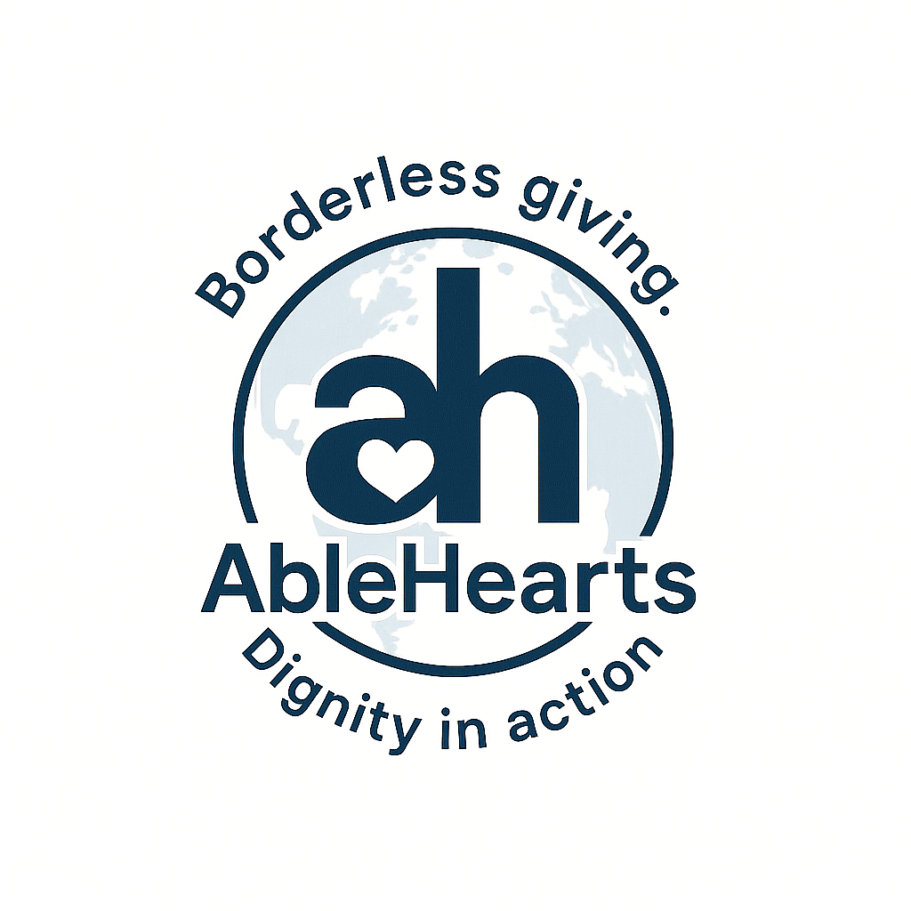
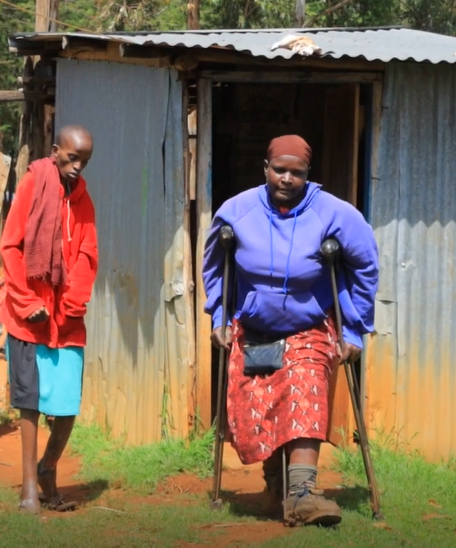
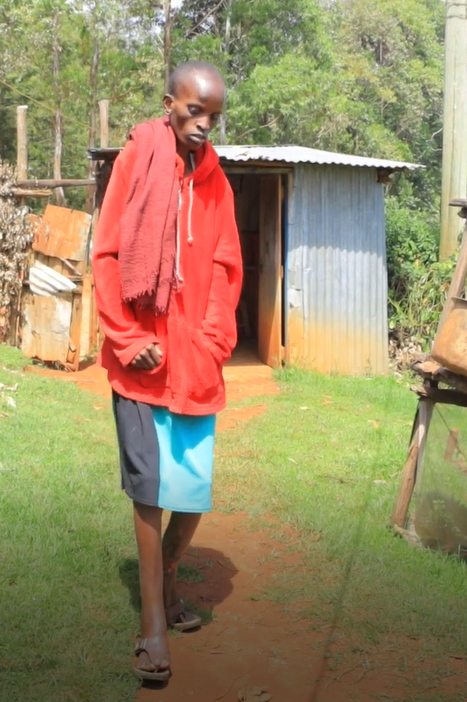

# [AbleHearts](https://ablehearts-org.vercel.app/)

> **Borderless giving. Dignity in action.**

## Meet Mary & Lydia ❤️

[AbleHearts](https://ablehearts-org.vercel.app/) was born out of love and necessity — to help **Mary Nyaboke Onchangu** and her daughter **Lydia Kwamboka Onchangu**, who live with physical challenges, share their journey and receive support from kind hearts around the world.

Through this platform, you can give what you are blessed to have — time, resources, or donations — ensuring Mary, Lydia, and many more in the global village live with dignity and hope.

| Mary $ Lydia                                                           | Lydia                                                               |
| ---------------------------------------------------------------------- | ------------------------------------------------------------------- |
|  |  |

## Their Story in Motion 🎥

- [Watch Mary’s Message](https://www.youtube.com/watch?v=iwoxJxv6sl8)
- [Lydia’s Journey](https://www.youtube.com/watch?v=XEoekzHT3rE)

## How You Can Help 🙌

Every contribution matters. Donations empower Mary & Lydia to:

- Access medical care 🏥
- Gain mobility support ♿
- Pursue education and opportunities 📚
- Inspire others in similar situations 🌍

👉 **[Donate Now](https://ablehearts-org.vercel.app/donate)**

👉 **[Learn More](https://ablehearts-org.vercel.app/about)**

👉 **[GoFundMe](https://www.gofundme.com/u/able-hearts)**

## Follow & Share 🌐

Stay connected and help us spread the word:

- X(Twitter): [@ablehearts_org](https://x.com/ablehearts_org)
- Tiktok: [@able_hearts](https://www.tiktok.com/@able_hearts)
- Mail Us: [ablehearts@hotmail.com](mailto:ablehearts@hotmail.com)

### Together, we are **Able Hearts** 💖
